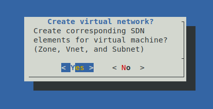

# proxmox-ve-utility-scripts


Collection of shell scripts to maximize efficiency when using Proxmox VE. Anyone is welcome to use these scripts, but if you run into issues, make improvements, or find them particularly useful - please let me know.

## Table of Contents

- [Introduction](#introduction)
- [Features](#features)
- [Installation](#installation)
- [Usage](#usage)
- [Scripts](#scripts)
- [Example](#example)
- [Resources](#resources)
- [License](#license)

## Introduction

This project contains a collection of shell scripts designed to make certain tasks quicker or easier. It's an ongoing project with an ulterior motive - to learn more about Proxmox VE, it's capabilities, and how to interact with it programmatically.

## Features

- Automate common tasks
- Improve system management
- Enhance productivity
- Clones!

## Installation

To install the scripts, clone the repository and navigate to the directory:

```sh
git clone https://github.com/albddnbn/proxmox-ve-utility-scripts.git
cd proxmox-ve-utility-scripts
chmod +x ./*.sh
```

## Usage

```bash
## ./<script>.sh
./create_vm.sh
```

All scripts in the base directory of the repository can be run without any parameters or arguments. They are designed to be interactive, mostly through the use of bash dialogs.

The repository contains two types of scripts at the moment:
1. Creation scripts (new): These scripts are used to create new resources, such as VMs, containers, etc.
2. Deletion scripts (rm): These scripts are used to delete resources, such as VMs, containers, etc.

## Scripts

### Creation scripts (new):

1. <b>new_lxc.sh</b>: Create a new container on the Proxmox VE host.
2. <b>new_network.sh</b>: Create a new simple zone, vnet, and subnet.
3. <b>new_vm.sh</b>: Create a new virtual machine.

### Deletion scripts (rm):

1. <b>rm_vm.sh</b>: Remove specified virtual machines.
2. <b>rm_zone.sh</b>: Remove specified zones, <b>and any corresponding vnet/subnet children</b>.

## Example

This is a walkthrough of running the create_vm.sh script. In this case, I'm creating a new domain controller for an Active Directory environment.

```bash
## Execute the script:
./create_vm.sh
```

A prompt will appear,  confirming the settings for the virtual machine.


After clicking submit, the script confirms the user's choice of storage for VM hard disk, and storage that contains ISOs.


The script checks specified storage, and presents another menu to gather user's selections for ISOs. It allows for one 'main iso' attached to th VM, and set to boot first. An additional ISO is also attached - for Windows VMs it's especially useful to have a VirtIO driver ISO attached.


A virtual network - simple zone with corresponding vnet and subnet - can be created if specified by the user. The script confirms settings through a dialog form (same as with VM settings).




After this, the virtual machine and virtual network are created.

## Resources

Script template: https://betterdev.blog/minimal-safe-bash-script-template/ for functions/scripts.

Form dialogs adapted from: https://bash.cyberciti.biz/guide/The_form_dialog_for_input

## License

This project is licensed under the GNU General Public License v3.0. You may obtain a copy of the License at

[https://www.gnu.org/licenses/gpl-3.0.en.html](https://www.gnu.org/licenses/gpl-3.0.en.html)

This program is free software: you can redistribute it and/or modify it under the terms of the GNU General Public License as published by the Free Software Foundation, either version 3 of the License, or (at your option) any later version.

This program is distributed in the hope that it will be useful, but WITHOUT ANY WARRANTY; without even the implied warranty of MERCHANTABILITY or FITNESS FOR A PARTICULAR PURPOSE. See the GNU General Public License for more details.

